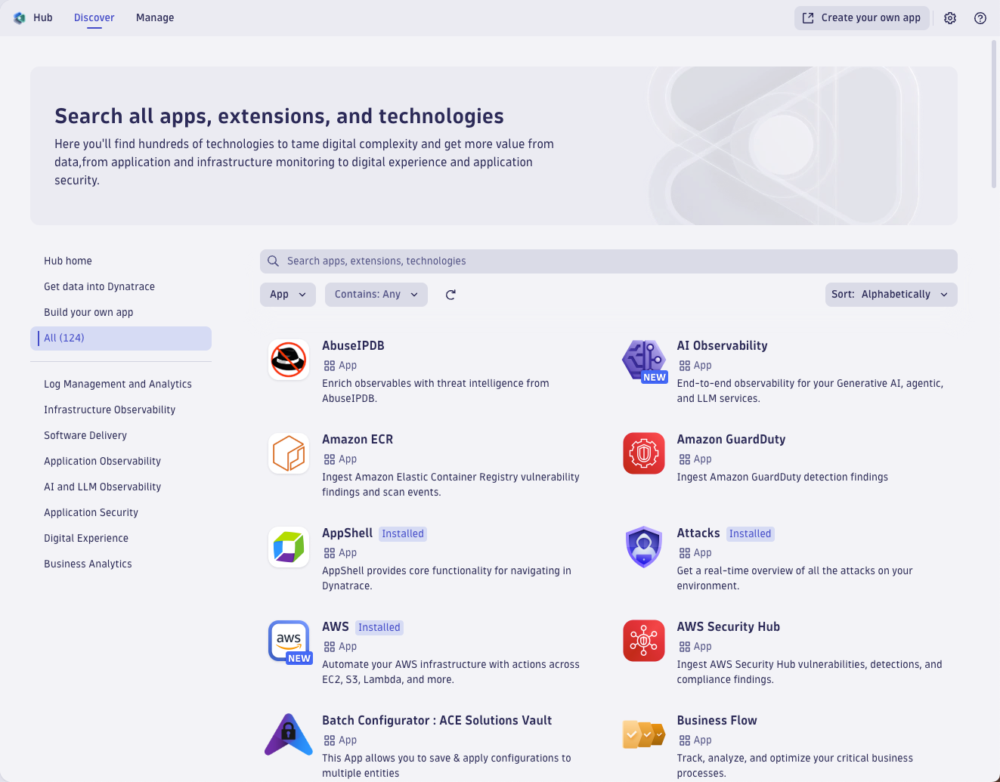
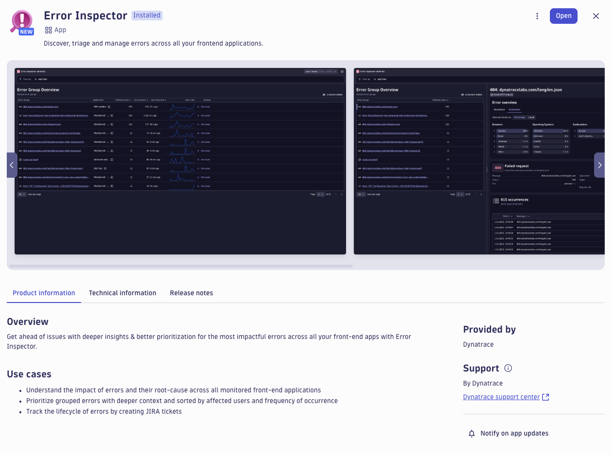
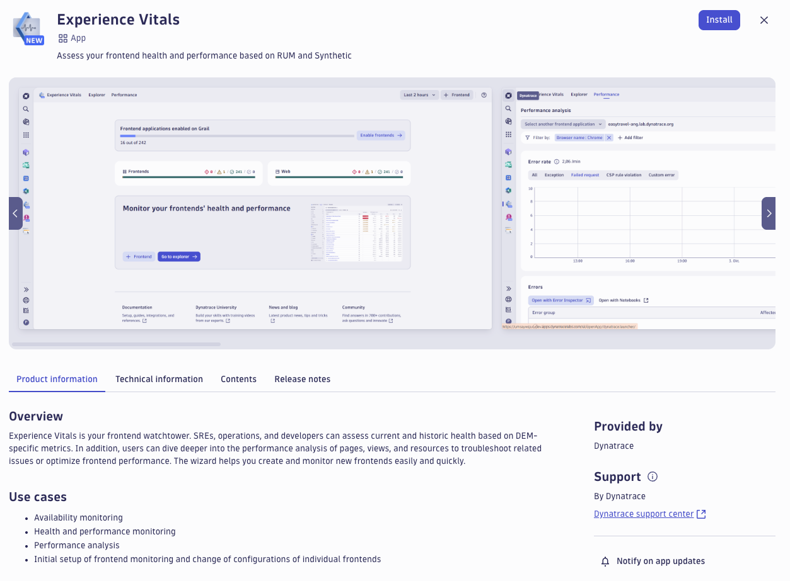
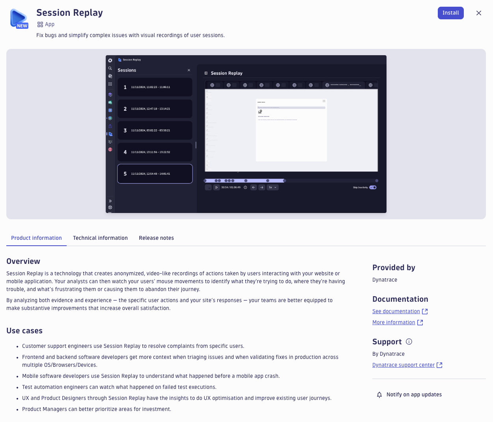
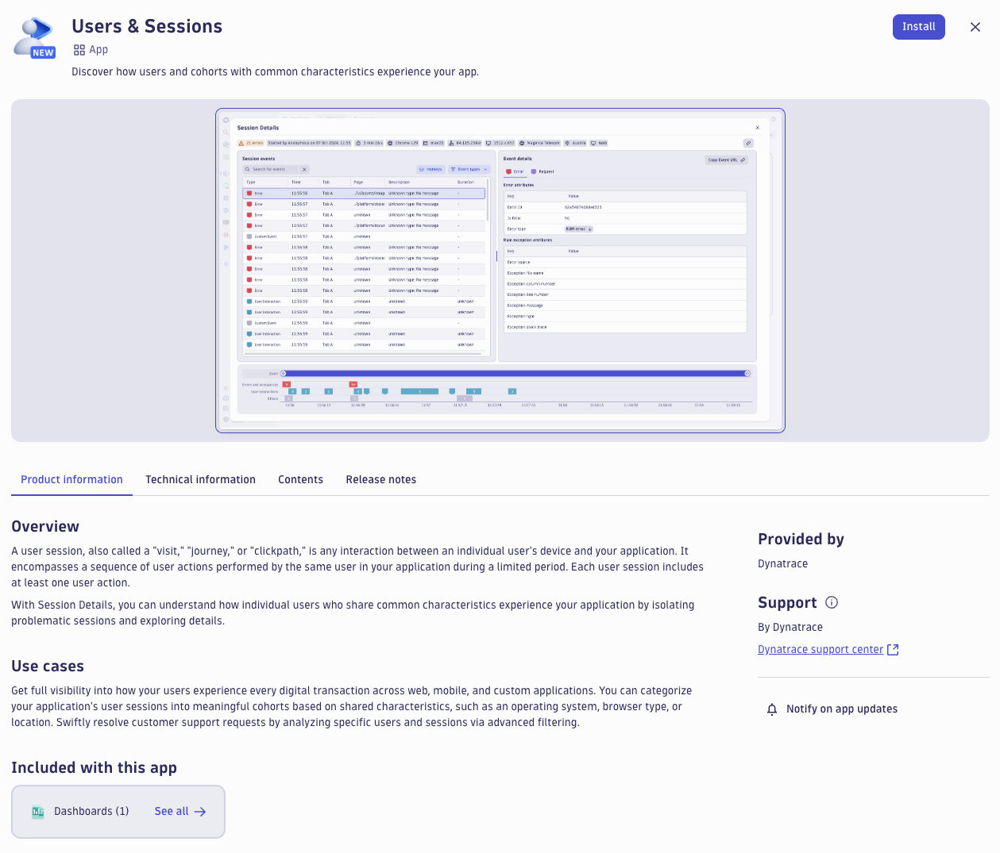
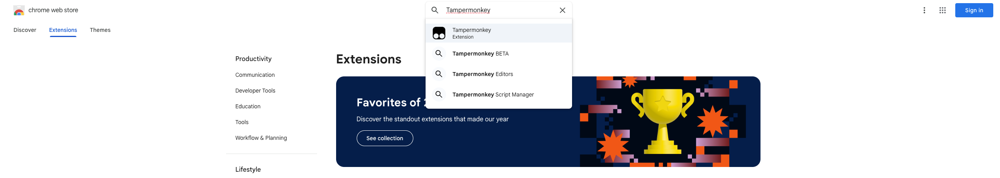
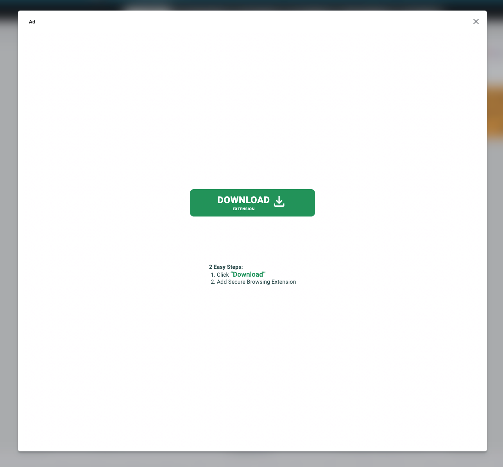

--8<-- "snippets/send-bizevent/2-getting-started.js"
--8<-- "snippets/requirements.md"

## Prerequisites

You will need full administrator access to a Dynatrace SaaS tenant with a DPS license.

* Install or validate DEM Apps
* Install Tampermonkey Chrome Extension
* Identify public-facing business website
    - Identify multi-page business flow sequence
* Create a Synthetic Browser Monitor

### Install or validate DEM Apps

In your Dynatrace SaaS tenant, launch the **Hub** App.

Validate that the **Error Inspector** App is installed.

Search for, locate, and install the **Experience Vitals** App.

Search for, locate, and install the **Session Replay** App.

Search for, locate, and install the **Users & Sessions** App.

### Install Tampermonkey Chrome Extension

Open your **Chrome** browser.  Navigate to the `Chrome Web Store`.

[Chrome Web Store](https://chromewebstore.google.com/category/extensions?utm_source=ext_sidebar&hl=en-US){target=_blank}

Search for the **Tampermonkey** extension.

Select the extension.  Click on `Add to Chrome` to install the extension.  When prompted, click `Add extension`.

Once the extension is installed, the Tampermonkey dashboard should appear to validate the installation.

!!! warning "Powered by Ads"
    The Tampermonkey extension is free and powered by advertisements.  Do not accidentally click on the advertisements.  Our team takes zero responsability for any affects of this extension and advertisements.
    

### Identify Public-facing Business Website

You will need a public-facing business website for this lab.

## Continue

In the next section, we'll explore the differences between a Customer Journey and a Business Journey.

- [Continue to Customer Journeys vs Business Journeys:octicons-arrow-right-24:](3-customer-business-journeys.md)

