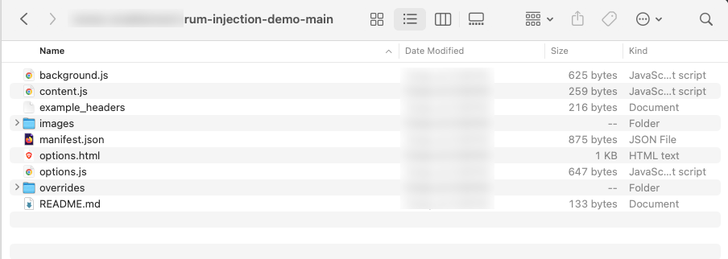
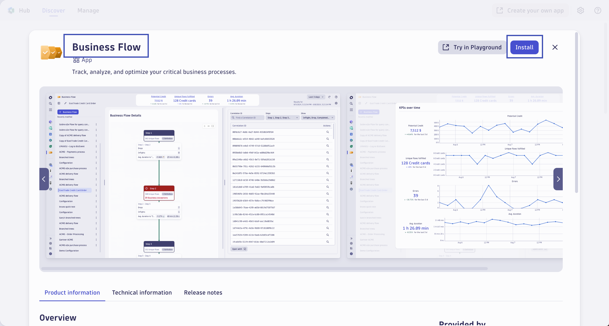

--8<-- "snippets/send-bizevent/2-getting-started.js"
--8<-- "snippets/requirements.md"

## Prerequisites

You will need full administrator access to a Dynatrace SaaS tenant with a DPS license.

* Install RUM Injection Extension for Chrome
* Install Dynatrace Session Replay Extension for Chrome
* Install Business Flow app
* Identify public-facing business website
    - Identify multi-page customer journey
* Identify multi-step business process with Microsoft CoPilot

### Install RUM Injection Extension for Chrome

Open Chrome and navigate to **[https://github.com/dynatrace-wwse/rum-injection-demo](https://github.com/dynatrace-wwse/rum-injection-demo){target=_blank}**, click the `Code` button, then `Download ZIP`


Open your download folder and unzip `rum-injection-demo-main.zip`



In Chrome, select `menu "𐄛"  > Extensions > Manage Extensions`

Enable Developer Mode in the top right

Click `Load Unpacked`

Nagivate to the unzipped directory from step #2 and click `Select`


### Install Dynatrace Session Replay Extension for Chrome

Navigate to the extension in the Chrome Web Store using Chrome.

[Chrome Web Store](https://chromewebstore.google.com/detail/session-replay-browser-ex/hjbdnbhpfiionafiooklnafmaojjfljh){target=_blank}

Install the extension.


### Install Business Flow app

In your Dynatrace tenant, launc the **Hub** app.  Locate and install the **Business Flow** app.



### Identify Public-facing Business Website

!!! tip "Example Business Website"
    For this lab guide, we will reference Google's flight tracking website.  Google is chosen due to their brand recognition, digital platform, typical end-to-end customer journey for their industry, and general fit for this exercise.  This lab, and the authors of this lab, have no affiliation to Google, their business, their observability strategy, or anything of the like.  All references to Google in this lab are from public facing non-confidential sources gathered through Microsoft CoPilot.

You will need a public-facing business website for this lab.  Identify a multi-step customer journey on that business website.

For example:

1. Homepage
2. Search Product
3. View Product
4. Add to Cart
5. Checkout
6. Place Order

You can/should skip any steps that require actual payment or personal information, as this is a training workshop.

### Identify Multi-step Business Process with Microsoft CoPilot

!!! tip "Example Business Process"
    For this lab guide, we will reference Walmart's order fulfillment process.  Walmart is chosen due to their brand recognition, ecommerce platform, typical end-to-end business processes for their industry, and general fit for this exercise.  This lab, and the authors of this lab, have no affiliation to Walmart, their business, their observability strategy, or anything of the like.  All references to Walmart in this lab are from public facing non-confidential sources gathered through Microsoft CoPilot. 

Use Microsoft CoPilot to identify the details of a multi-step business process.

In the text below, replace `COMPANY`, `COUNTRY`, `FIRST STEP`, and `LAST STEP` with the details for your company.

```
In the below prompt, replace:
{Company Name} with COMPANY
{Country} with COUNTRY
{Business Process} with Business Process from FIRST STEP to LAST STEP

I’m working with {Company Name} in {Country} to build a business analytics dashboard that maps out the end-to-end business process of {Business Process} and ties IT context to business KPIs. Provide 2 outputs and ensure to use {Company Name}’s terminology and language.

Output 1: A simple numbered list of the logical steps in the process. 
Output 2: A detailed explanation for all the logical steps, critical non-technical business KPIs for each step and for the entire process, and IT and technology tied to each of the steps. 

If there are more than 5 steps, simplify to the 5 most business-critical steps.
```

Save the output of the prompt somewhere that you can access it later, such as in a Dynatrace Notebook.

## Continue

In the next section, we'll explore the differences between a Customer Journey and a Business Journey.

<div class="grid cards" markdown>
- [Continue to Customer Journeys vs Business Journeys:octicons-arrow-right-24:](3-customer-business-journey.md)
</div>