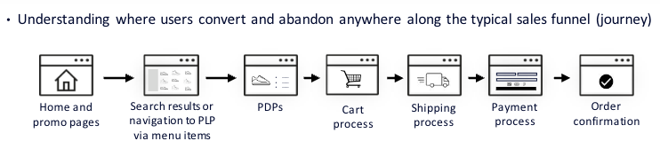
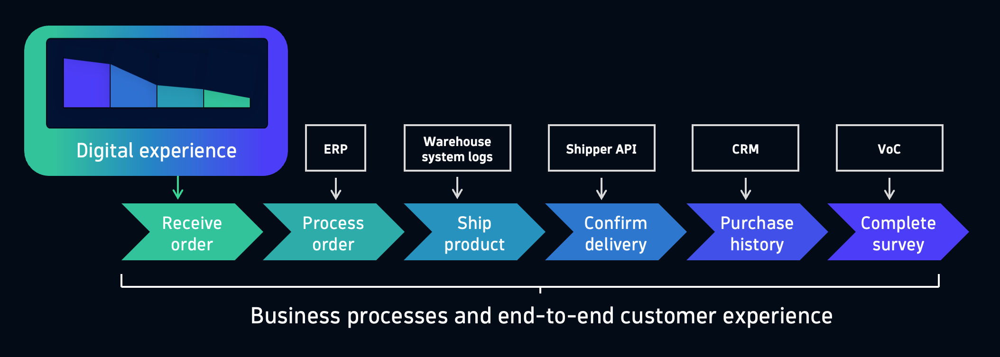
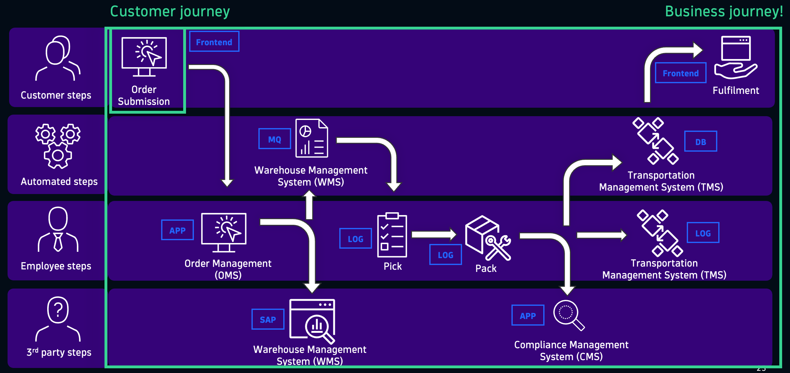
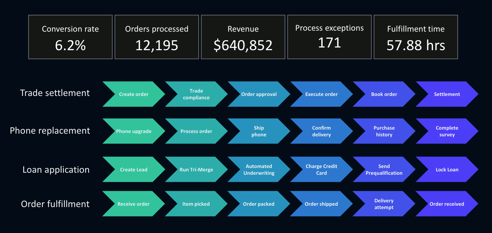

# Customer Journey vs Business Journey
--8<-- "snippets/send-bizevent/3-customer-business-journey.js"

## Understanding Customer vs Business Journeys

**Goals**

- Define what a **Customer Journey** is
- Define what a **Business Journey** is
- Distinguish between the two using real-world examples
- Understand how both journeys contribute to digital success

### Customer Journey

🧭 **What is a Customer Journey?**

**Definition**:

A **Customer Journey** is the path a user takes while interacting with a digital product or service, focusing on their **experience** and **actions**.

**Key Characteristics**:

- Begins with a user’s **intent** (e.g., searching for a product)
- Involves **digital touchpoints** (e.g., search, click, add to cart)
- Ends when the user completes a **goal** (e.g., placing an order)

**Example**:  
> A user visits a retail website, searches for a laptop, reads reviews, adds it to their cart, and places an order.

🧩 **Think About It**:  
What steps do you take when buying something online? That’s your customer journey!

### Business Journey

🏢 **What is a Business Journey?**

**Definition**:

A **Business Journey** is the **end-to-end operational process** that begins with a customer interaction and ends with a **business outcome**.

**Key Characteristics**:

- Triggered by a customer action (e.g., order placed)
- Involves **backend systems** (e.g., payment, inventory, shipping)
- Ends with a **business result** (e.g., item delivered, revenue recorded)

**Example**:  
> After the customer places the order, the system processes payment, locates the item in inventory, ships it, and confirms delivery.

🧩 **Think About It**:  
What happens behind the scenes after you click “Buy Now”? That’s the business journey!

### Comparison

🔍 **Comparing the Two**

| Feature              | Customer Journey                          | Business Journey                             |
|----------------------|-------------------------------------------|----------------------------------------------|
| **Focus**            | User experience                           | Operational fulfillment                      |
| **Starts With**      | User interaction                          | Customer action (e.g., order placed)         |
| **Ends With**        | User goal achieved                        | Business outcome achieved                    |
| **Perspective**      | Customer-centric                          | Business-centric                             |
| **Tools Involved**   | UX, analytics, A/B testing                | ERP, CRM, logistics, supply chain systems    |

### Summary

- **Customer Journey** = What the user does and experiences
- **Business Journey** = What the business does to fulfill that experience
- Both are essential for delivering great digital products and services

🧪 **Interactive Exercise**

**Scenario**: A customer orders a pair of shoes online.

- **Question 1**: What are the steps in the customer journey?
- **Question 2**: What are the steps in the business journey?

💡 *Tip: Think about what the customer sees vs. what the business does behind the scenes.*

## Continue

In the next section, we'll configure Real User Monitoring and observe the Customer Journey in Dynatrace.

- [Continue to observing Customer Journey with Real User Monitoring:octicons-arrow-right-24:](4-real-user-monitoring.md)

