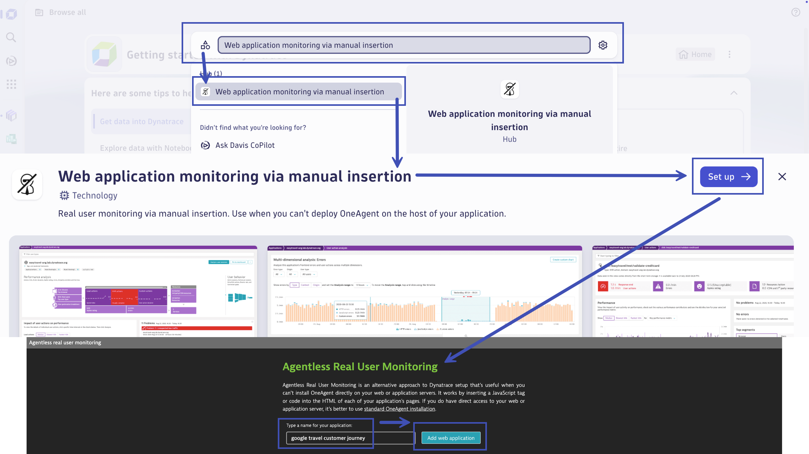
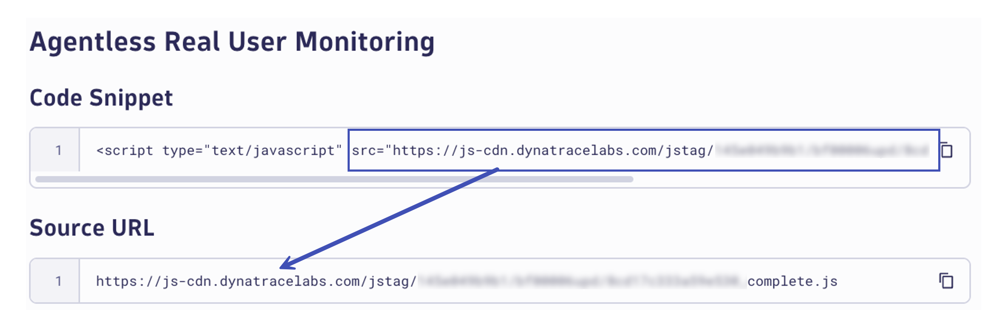
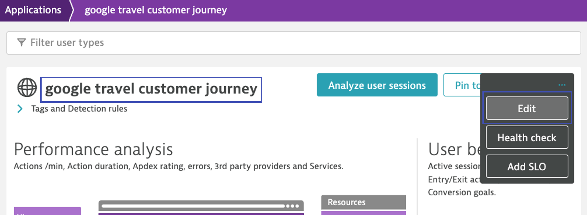
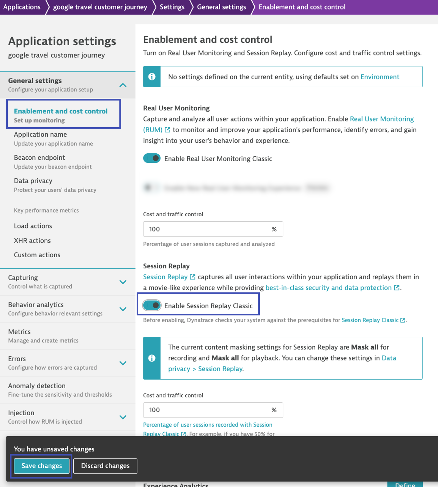
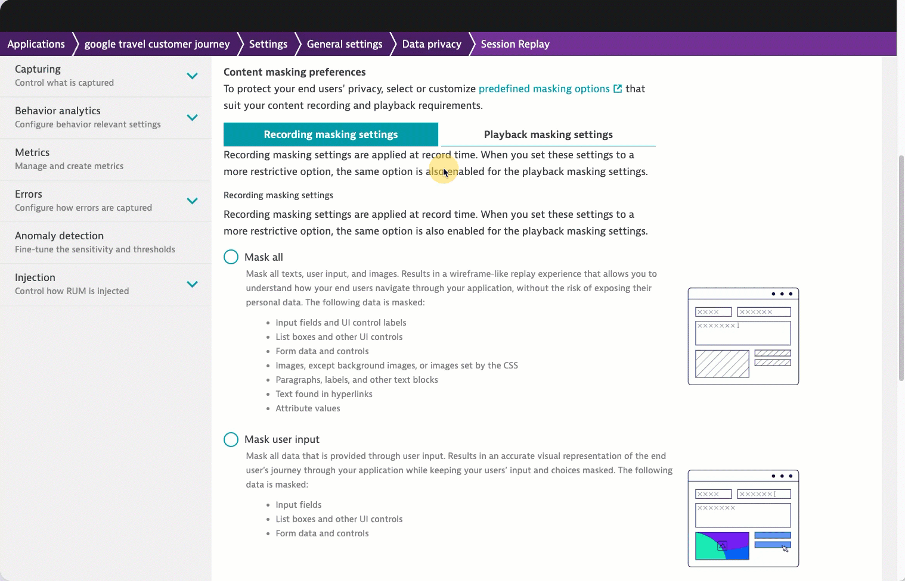
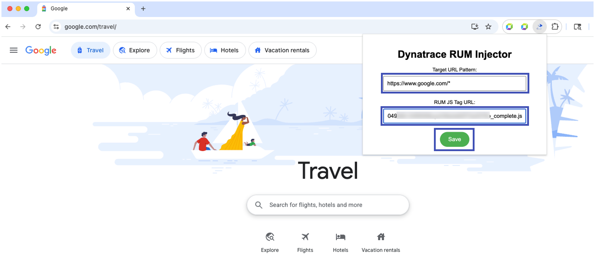
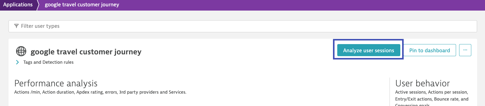

# Real User Monitoring
--8<-- "snippets/send-bizevent/4-real-user-monitoring.js"

Dynatrace Real User Monitoring (RUM) gives you the power to know your customers by providing performance analysis in real time. This includes all user actions taken and how the various actions impact performance. You can also easily identify problems or errors that occurred as well as user experience ratings, geolocation breakdowns, and much more. You can also gain insight into the behavior of your users. This among others includes the number of customers who return to your site. With Dynatrace RUM, you have the context over time and immediate analysis to the complete picture of your end-user experience.

<div class="grid cards" markdown>
- [Learn More:octicons-arrow-right-24:](https://docs.dynatrace.com/docs/observe/digital-experience/rum-concepts/rum-overview#real-user-monitoring){target="_blank"}
</div>

## Configure Real User Monitoring

[Download Notebook](https://github.com/dynatrace-wwse/enablement-browser-dem-biz-observability/blob/main/docs/assets/dynatrace/notebook/Customer_Journey.json){target=_blank}

In your Dynatrace tenant, open the **Notebooks** app.  Click `Upload` to upload the `Customer_Journey` notebook.

Begin by modifying the first markdown section with the details about your company, `Company Name` and `Website URL`.  At the end of the URL, add a `*` so that it ends with `/*`.


### Create Agentless RUM Application

In your Dynatrace tenant, open the search menu and search for **Web application monitoring via manual insertion**.

```text
Web application monitoring via manual insertion
```

Click on the match found in the Hub.  Click on `Setup`.

Next, you'll need to provide a name for your application, use a naming convention `<company name> customer journey`.  Click `Add web application`.



Once the application is created, first click on `Copy JavaScript tag`, then click on `View application`.


While the tag is on your clipboard, navigate back to the **Notebooks** app and paste the value into the notebook.  Within your script tag is a `src` attribute.  Copy the value from within the `src` and paste it into the `Source URL` placeholder.



Navigate back to the **Frontend** app.  You should be viewing the web application you just created.  Locate the `...` ellipses button on the right, click it, and then click on `Edit` to edit the configuration settings of the application.



In the left-hands sub-menu, click on `Enablement and cost control`.  Locate and enable `Enable Session Replay Classic` to turn on Session Replay for this application.  Click on `Save` to save the changes.



In the left-hand sub-menu, click on `Data privacy`.  At the top, click on `Session Replay`.  This is where you can control data privacy settings for the Session Replay capabilities, specifically what is masked during recording and what is masked during playback.


!!! tip "Data Privacy and Security"
    When using Session Replay (and any other capability where sensitive data could come into play) it's important to configure data privacy and security settings appropriately.  By default, Dynatrace masks everything, erring on the side of caution and focusing on security over visibility.  When actually setting Session Replay for real applications, take the time to properly design and configure these settings to keep the environment secure.  Consult the [documentation here](https://docs.dynatrace.com/docs/observe/digital-experience/session-replay/configure-session-replay-web){target=_blank} for more details.

For this lab, we will only be capturing sessions and replays for our own browser activity.  Since we shouldn't be submitting any personal information during this exercise, we can go ahead and disable all masking.

Start by configuring the masking settings for recording.  When data is masked at recording, it is never captured, transmitted or stored.  Therefore, it can never be viewed during playback.

From the list of options, choose `Block list`.  This will create a series of rules that will essentially block (mask) everything on the page.  Go through and delete every rule, resulting in nothing being blocked (masked).


Click on the playback masking settings.  Here you can configure which data that was not masked during recording, is masked during playback.  If data is not masked at recording, you can use user permissions to control who has access to view replays unmasked.  By default, users with access to replays can only see masked data - based on these settings.

From the list of options, choose `Block list`.  This will create a series of rules that will essentially block (mask) everything on the page.  Go through and delete every rule, resulting in nothing being blocked (masked).



Real user monitoring and session replay is now configured!

### Configure RUM Injection Extension

In your Chrome browser, navigate to the company website.  Click on `Extensions` in the toolbar and locate the **Dynatrace RUM Injector** extension.  Click on it to configure it.


In the **Target URL Pattern**, copy and paste the URL from your notebook for the company website.

In the **RUM JS Tag URL**, copy and paste the source URL from your notebook for the RUM JavaScript tag location.



**Content Security Policy CSP**

You will almost certainly encounter sites that restrict remote content loading and requests using the [Content Security Policy (CSP)](https://developer.mozilla.org/en-US/docs/Web/HTTP/Guides/CSP){target=_blank}. 

Content Security Policy (CSP) is a feature that helps to prevent or minimize the risk of certain types of security threats. It consists of a series of instructions from a website to a browser, which instruct the browser to place restrictions on the things that the code comprising the site is allowed to do.

The primary use case for CSP is to control which resources, in particular JavaScript resources, a document is allowed to load. This is mainly used as a defense against [cross-site scripting (XSS)](https://developer.mozilla.org/en-US/docs/Glossary/Cross-site_scripting){target=_blank} attacks, in which an attacker is able to inject malicious code into the victim's site.

Since we are injecting our RUM locally via an extension, you will see these warnings in your Chrome Developer Tools Console.

### Configure CSP Overrides

!!! warning "Overrides Active with Developer Tools Only"
    Enabling these local overrides only function while the Chrome Developer Tools are open.  Be sure to leave them open for the entire time that you're doing this exercise and browsing the website.

Navigate to the website (you should be there already).

Open the Developer Tools `View > Developer > Developer Tools`. Switch to the `Sources` tab, then `Overrides` sub-tab.

Click `Select folder for overrides`.  Navigate to the `overrides` directory **in your unzipped extension folder** and press `Select`.

If prompted to allow local edit, click `Edit`.


Click and hold the refresh button and select `Empty cache and hard reload`.  As the page loads, navigate to the `Network` tab of Developer Tools and locate the Dynatrace RUM beacons.  You can filter on `Fetch/XHR` request types and the pattern `bf?`.  Validate that you're seeing HTTP status **200**.


!!! tip "Troubleshooting"
    If you're not seeing beacons with HTTP status 200, try opening the website in a new tab or window and validate the following:
    1. The Dynatrace RUM JavaScript tag is injected on the page, in the `<header>` of the html
    2. There aren't any CSP errors in the `Console`
    3. The URL pattern and source URL are correct in the extension configuration

Now that you've validated that real user monitoring is working, navigate from the start of the customer journey to the end.  Be sure to keep Developer Tools open the entire time so that the local overrides take effect.  When you start the journey, tag your user session with your user identifier.  When you end your journey, manually end the journey with the console command.

Tag User:
```javascript
dtrum.identifyUser('user-name')
```

End Session:
```javascript
dtrum.endSession()
```


!!! tip "Ending Sessions"
    Normally, user sessions end on one of the ways [documented here](https://docs.dynatrace.com/docs/shortlink/user-session#user-session-end){target=_blank}.  However, we want to be able to create a bunch of sessions quickly without having to close the browser or wait for inactivity. To do this, navigate to the console in Chrome Developer Tools and type `dtrum.endSession()` and hit enter to end the session manually.

## Session Replay

Session Replay is a powerful tool that can modernize your Digital Experience Monitoring (DEM) strategy. You can use it to capture and visually replay the complete digital experience of every user.

You can record your customers' interactions with your application and replay each click or tap in a movie-like experience. Session Replay also makes it easy for your QA teams to reproduce production issues, which your developers can use to bridge the gap between code and user experience.

Session Replay helps identify errors that should be fixed immediately and other problems such as malformed pages and infinite spinners. You can also use Session Replay to identify and analyze areas of struggle in your application and improve its overall usability.

### Watch Session Replay

In your Dynatrace tenant, open the **Frontend** app.  Navigate to your web application.  In the top right corner, click on `Analyze user sessions`.



From the list of user session identifiers for your web application, locate your tagged user identifier.  Click on the user name.


This will bring up a list of sessions for that user tag.  There should be 1 (or more) sessions.  Click on the `Play` icon to view and playback the session.


Scroll down to the session replay section of the session.  Click on the `Play` icon and watch the session in a movie-like experience.


Now that we understand the user's digital experience, let's observe the business outcome of the customer journey with BizEvents!

## Continue

In the next section, we'll observe business outcomes with real user monitoring.

<div class="grid cards" markdown>
- [Continue to Business Observability with RUM:octicons-arrow-right-24:](5-business-observability-rum.md)
</div>
