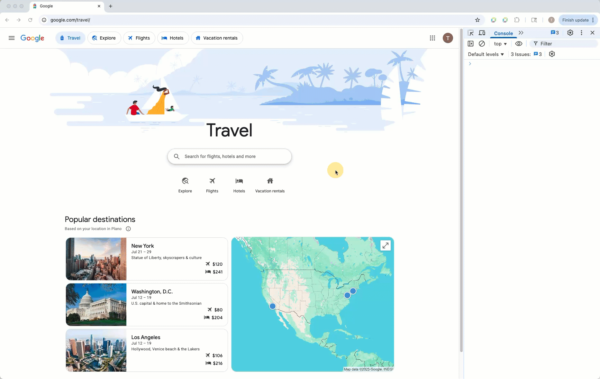
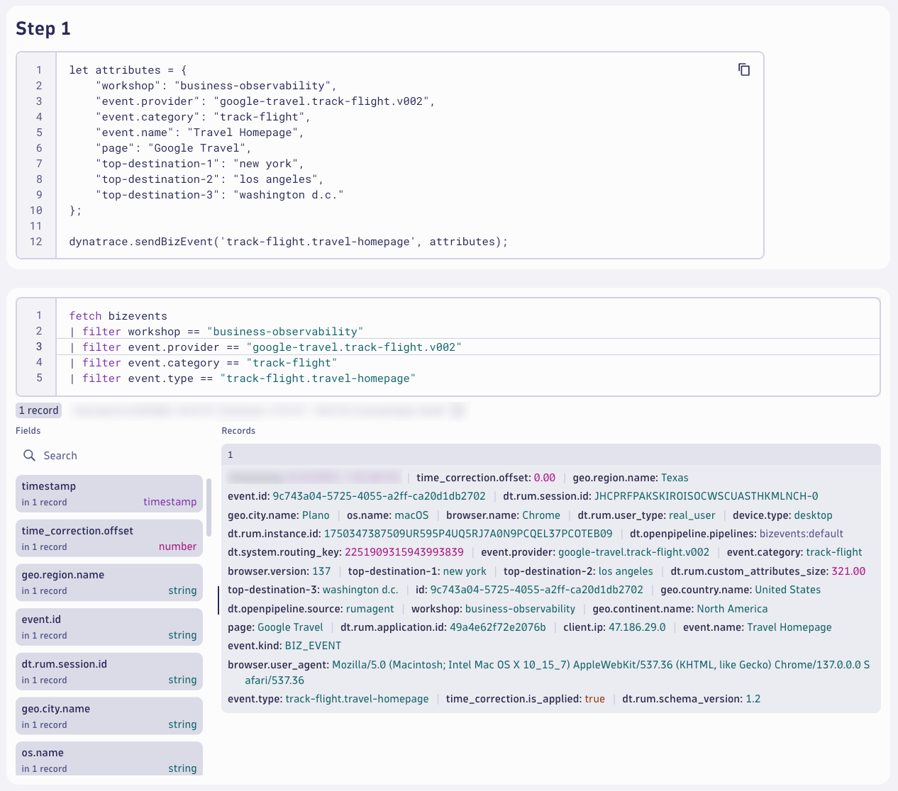
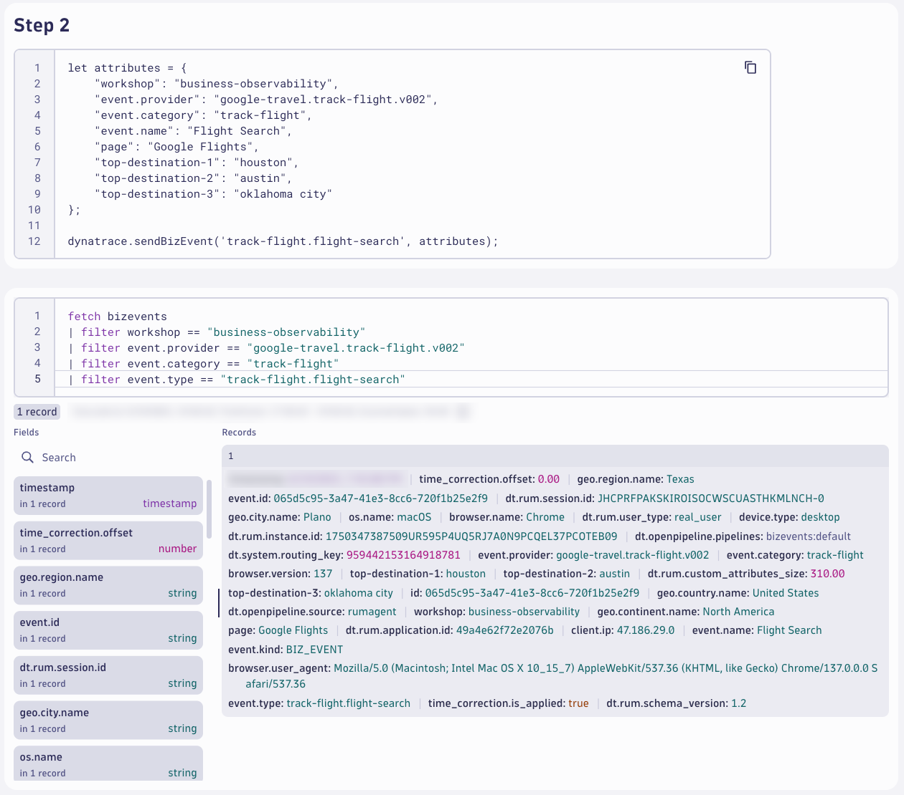
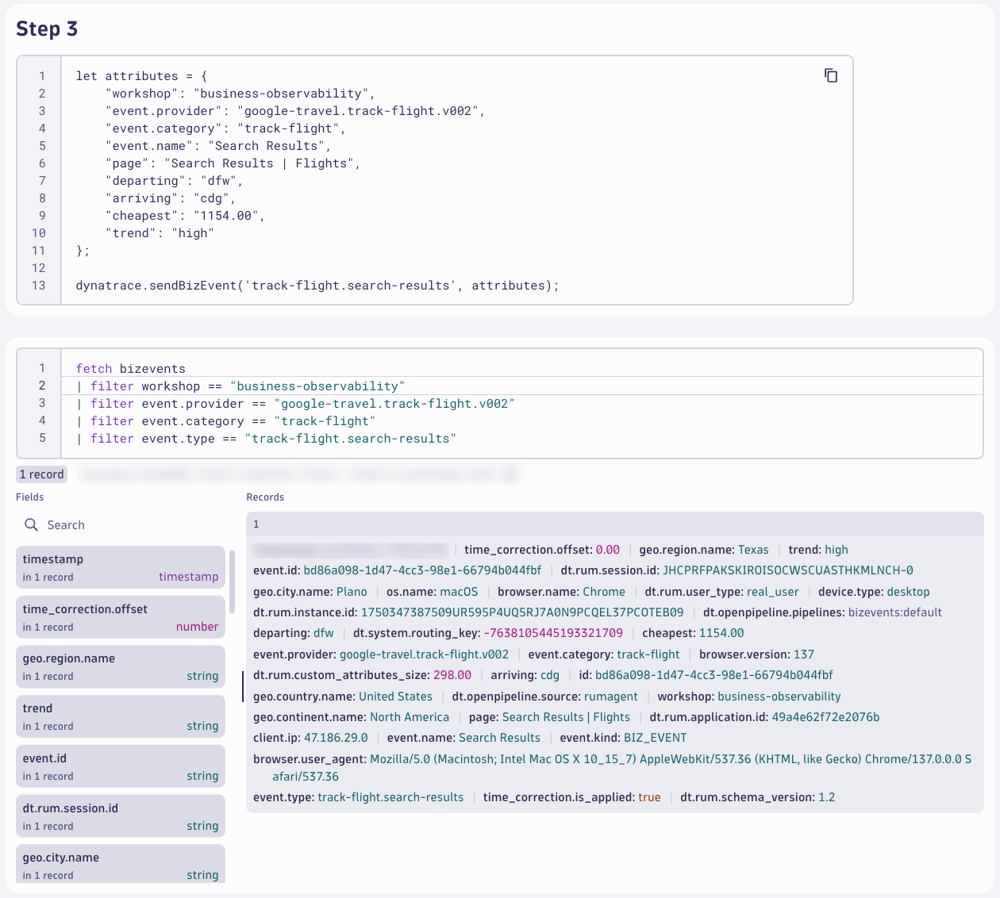
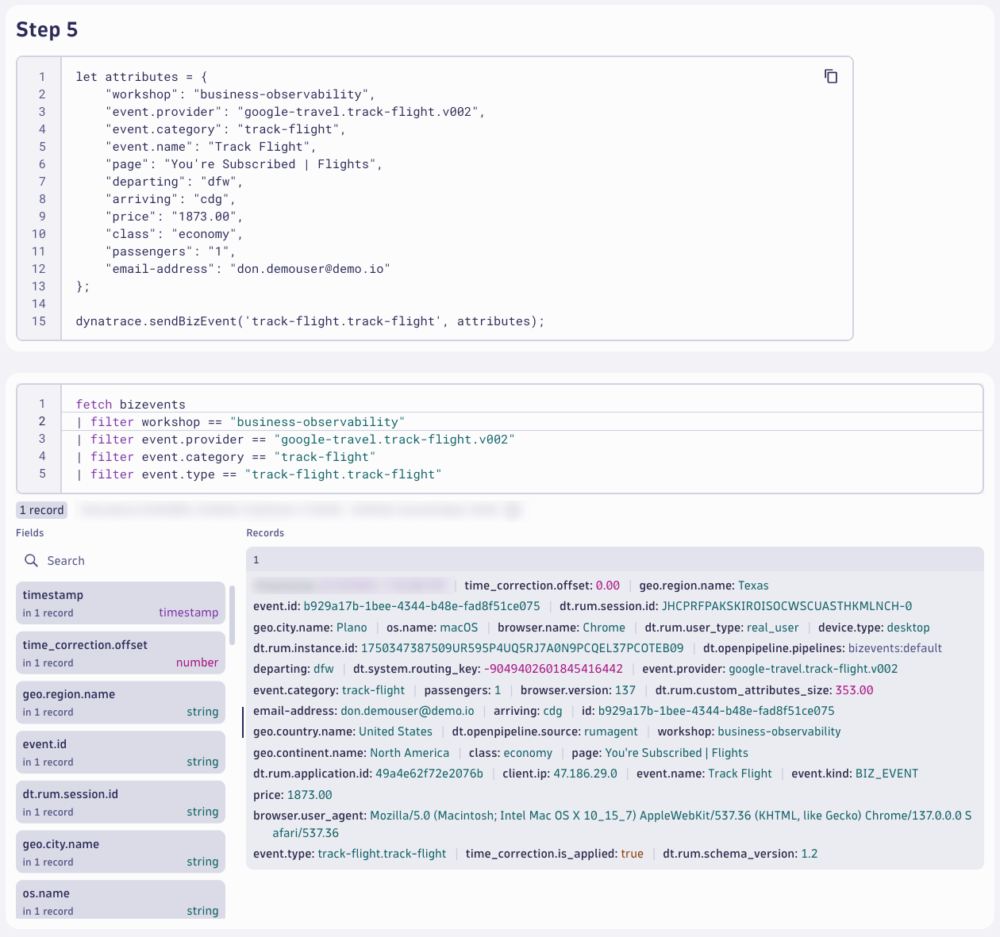

# Business Observability with RUM
--8<-- "snippets/send-bizevent/5-business-observability-rum.js"

Business events (BizEvents) are an important concept and central to Dynatrace Business Analytics. Business events generate business-grade data to enable important use cases.

Business events are available for all Dynatrace RUM technologies (web RUM, mobile RUM, and OpenKit). RUM business events can be obtained by leveraging a dedicated method of the RUM JavaScript, OneAgent for mobile, or OpenKit.

<div class="grid cards" markdown>
- [Learn More:octicons-arrow-right-24:](https://docs.dynatrace.com/docs/shortlink/ba-business-events-capturing#report-business-event-rum){target="_blank"}
</div>

## Customer Journey

Now that we understand the customer's digital experience, thanks to Real User Monitoring and Session Replay, now we want to understand the business outcomes of the customer journey.  We can accomplish this by sending BizEvents with the RUM JavaScript agent during the customer journey process.

### Prepare BizEvents

If you haven't already, download the `Customer_Journey` notebook.

[Download Notebook](https://github.com/dynatrace-wwse/enablement-browser-dem-biz-observability/blob/main/docs/assets/dynatrace/notebook/Customer_Journey.json){target=_blank}

In your Dynatrace tenant, open the **Notebooks** app.  Click `Upload` to upload the `Customer_Journey` notebook.

Locate the **Customer Journey** markdown section.  Edit the markdown section and update the values with the details from your selected company's digital customer journey.

Google Travel Track Flight example:

* Journey Name: `Track Flight`
* Step 1: `Travel Homepage`
* Step 2: `Flight Search`
* Step 3: `Search Results`
* Step 4: `Select Flight`
* Step 5: `Track Flight`

Locate the **BizEvent Template Example** markdown section.  Here you will find the code snippet example for sending a BizEvent using the Dynatrace RUM JavaScript agent/sdk.  You'll adapt the `attributes` to that of your customer journey.

Locate the **Customer Journey BizEvents** markdown section.  Below this section you'll find (10) sections; one markdown section with a code snippet and one DQL query for bizevents for each step of the customer journey.

Modify each section and replace the placeholder names with the actual values for your customer journey.  It's recommended that you go through the customer journey as you are making these changes so that you can identify the actual page names and potential custom properties that are relevant for each step.  However, the custom properties are optional - but recommended to add more business value.

Once you've modified the code snippet, start a new browser session and move through the customer journey.  Pause at each step of the journey and use the developer tools console to send a BizEvent with the correct payload.



After sending the BizEvent, wait a minute (usually sooner) and query the BizEvents in the notebook.

Complete step 1, send a BizEvent, and query the results.



Complete step 2, send a BizEvent, and query the results.



Complete step 3, send a BizEvent, and query the results.



Complete step 4, send a BizEvent, and query the results.


Complete step 5, send a BizEvent, and query the results.



Now that you have observability into the entire customer journey, use DQL and your creativity to analyze the business outcome of this journey.

Google Travel Track Flight example:

DQL:
```
fetch bizevents
| filter workshop == "business-observability" and event.provider == "google-travel.track-flight.v002" and event.category == "track-flight"
| filter event.type == "track-flight.travel-homepage"
| limit 1
| join kind: inner, [
    fetch bizevents
    | filter workshop == "business-observability" and event.provider == "google-travel.track-flight.v002" and event.category == "track-flight"
    | filter event.type == "track-flight.travel-homepage"
  ], on: {dt.rum.session.id}, prefix: "travel-homepage."
| join kind: inner, [
    fetch bizevents
    | filter workshop == "business-observability" and event.provider == "google-travel.track-flight.v002" and event.category == "track-flight"
    | filter event.type == "track-flight.flight-search"
  ], on: {dt.rum.session.id}, prefix: "flight-search."
| join kind: inner, [
    fetch bizevents
    | filter workshop == "business-observability" and event.provider == "google-travel.track-flight.v002" and event.category == "track-flight"
    | filter event.type == "track-flight.search-results"
  ], on: {dt.rum.session.id}, prefix: "search-results."
| join kind: inner, [
    fetch bizevents
    | filter workshop == "business-observability" and event.provider == "google-travel.track-flight.v002" and event.category == "track-flight"
    | filter event.type == "track-flight.select-flight"
  ], on: {dt.rum.session.id}, prefix: "select-flight."
| join kind: inner, [
    fetch bizevents
    | filter workshop == "business-observability" and event.provider == "google-travel.track-flight.v002" and event.category == "track-flight"
    | filter event.type == "track-flight.track-flight"
  ], on: {dt.rum.session.id}, prefix: "track-flight."
| fieldsAdd `decision-time-step-2` = if(isNotNull(`flight-search.timestamp`),(`flight-search.timestamp` - timestamp), else: null)
| fieldsAdd `decision-time-step-3` = if(isNotNull(`search-results.timestamp`),(`search-results.timestamp`- `flight-search.timestamp`), else: null)
| fieldsAdd `decision-time-step-4` = if(isNotNull(`select-flight.timestamp`),(`select-flight.timestamp` - `search-results.timestamp`), else: null)
| fieldsAdd `decision-time-step-5` = if(isNotNull(`track-flight.timestamp`),(`track-flight.timestamp` - `select-flight.timestamp`), else: null)
| fieldsAdd conversion = if(isNotNull(`track-flight.event.id`), true, else: false)
| fields {journeyStartTime = timestamp, 
          journeyId = dt.rum.session.id,
          conversion,
          userCountry = geo.country.name,
          userRegion = geo.region.name,
          userCity = geo.city.name,
          decisionTimeStep2 = `decision-time-step-2`,
          decisionTimeStep3 = `decision-time-step-3`,
          decisionTimeStep4 = `decision-time-step-4`,
          decisionTimeStep5 = `decision-time-step-5`,
          departingAirport = `track-flight.departing`,
          arrivingAirport = `track-flight.arriving`,
          price = `track-flight.price`
          }
```


Wow!  What a powerful query that let's us understand everything about the customer journey.  Business Observability and Analytics focuses on the business outcomes and business KPIs.  You don't need to use BizEvents to understand performance, availability, reliability, or correctness - that's what real user monitoring and session replay does for you natively!  This example is very powerful, but wouldn't it be nice if Dynatrace would provide this level of analysis automatically without having to write long DQL queries?  Great news, it can!  In the next section we'll explore Business Flows and Business Observability Automation.

## Continue

In the next section, we'll automate business observability with Workflows in Dynatrace.

<div class="grid cards" markdown>
- [Continue to Business Observability Automation:octicons-arrow-right-24:](6-business-observability-automation.md)
</div>